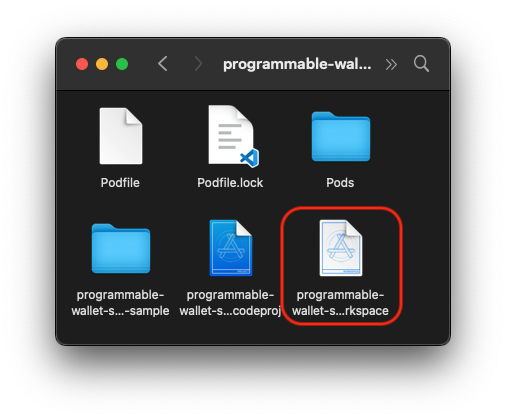

# programmable-wallet-sdk-ios-sample
This is a sample project for iOS beginners to integrate with CircleProgrammableWalletSDK.

- Bookmark
  - [Requirements](#requirements)
  - [Installation](#installation)
  - [Run the project](#run-the-project)
---

## Requirements

### Xcode
Install Apple’s Xcode development software: [Xcode in the Apple App Store](https://apps.apple.com/tw/app/xcode/id497799835?mt=12).

### CocoaPods
**CocoaPods** is a dependency manager for iOS projects. [Install CocoaPods by Homebrew](https://formulae.brew.sh/formula/cocoapods). (suggested)

> Check if Homebrew is installed:
```shell
$ brew
```
> How to install Homebrew in MacOS: [Link](https://mac.install.guide/homebrew/3.html)
### SSH key
Shared [SSH key](https://share.1password.com/s#bzIRVj59HVFKzKj1LbZToCDh10DyPVlRKTmhFbVqmuo) for PW SDK Hackathon


1. `$ vi ~/.ssh/{your SSH key name}`, then paste the private key
2. `$ chmod 400 ~/.ssh/{your SSH key name}`
3. Open your `~/.ssh/config` file, then modify the file to contain the following lines.
    ```default
    Host bitbucket.com
      AddKeysToAgent yes
      UseKeychain yes
      IdentityFile ~/.ssh/{your SSH key name}
    ```
4. `$ ssh-add --apple-use-keychain ~/.ssh/{your SSH key name}`
5. `$ ssh -T git@github.com` to try the connection

> How to setup an exist SSH key? : see [this](https://docs.github.com/en/authentication/connecting-to-github-with-ssh/generating-a-new-ssh-key-and-adding-it-to-the-ssh-agent#adding-your-ssh-key-to-the-ssh-agent)

## Installation

1. Clone this repo
2. Open project folder `$ cd programmable-wallet-sdk-ios-sample`
3. Run `$ pod install` to install `CircleProgrammableWalletSDK`
4. Run `$ pod update` to update `CircleProgrammableWalletSDK` (Optional)
5. Open the `programmable-wallet-sdk-ios-sample.xcworkspace` in Xcode


## Run the project

1. Put your `APP ID` in the `WalletSdkAdapter`


2. Select a simulator as run target
3. press `Run` button (Command + R)

